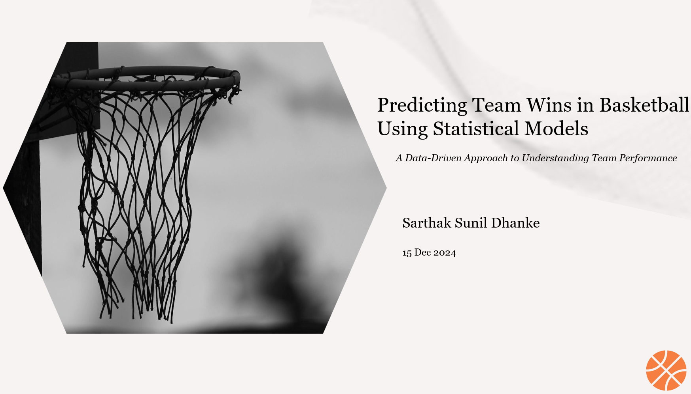

# Predicting The Percentage of Wins Using Regression Models



## Project Overview
This project aims to predict the percentage of wins for a NBA teams in a given season using basic statistical and machine learning models. By analyzing team-level data, we developed insights into the key factors contributing to team success and built robust predictive models to evaluate these factors.

## Key Objectives
1. Predict the number of percentage of wins based on performance metrics.
2. Explore and resolve challenges like multicollinearity, heteroscedasticity, and non-independence of residuals.
3. Validate model assumptions and identify influential data points.
4. Compare linear regression with advanced methods like random forests and gradient boosting.

## Dataset
The dataset contains team-level performance metrics for multiple seasons. Variables include:
- **adj_n_rtg**: Adjusted net rating.
- **pace**: Pace of play.
- **ts_percent**: True shooting percentage.
- **orb_percent**: Offensive rebound percentage.
- **opp_e_fg_percent**: Opponent effective field goal percentage.
- **opp_tov_percent**: Opponent turnover percentage.

### Data Cleaning and Preprocessing
- Removed multicollinear variables using Variance Inflation Factor (VIF) analysis.
- Normalized features to improve model performance and interpretability.
- Handled missing and inconsistent values in the dataset.
- Performed exploratory data analysis to understand feature distributions and relationships.

## Models Developed
1. **Linear Regression**
   - Assumptions checked using diagnostics:
     - Homoscedasticity (Output vs Residual Plot and Breusch-Pagan test).
     - Normality of residuals (QQ Plot and Shapiro-Wilk test).
     - Independence of residuals (Autocorrelation Plot and Durbin-Watson test).
   - Addressed multicollinearity using VIF analysis.

2. **Random Forest Regression**
   - Hyperparameter tuning performed using grid search.
   - Evaluated feature importance to identify key predictors of team wins.

3. **Gradient Boosting (Optional)**
   - Compared results with other models to ensure robustness.

## Key Challenges and Solutions
- **Multicollinearity:** Resolved by removing highly correlated variables identified via VIF analysis.
- **Heteroscedasticity:** Tested using Breusch-Pagan and addressed via model improvements.
- **Outliers:** Identified using Cook’s distance and leverage plots; investigated their impact on model results.
- **Non-Gaussian Distribution:** Residual normality checked via Shapiro-Wilk test; ensured Gaussian-like behavior for linear regression.

## Results and Insights
- Linear regression achieved an adjusted R-squared of 0.72, indicating 72% of variance explained.
- XGBoost model improved performance with an RMSE of 0.005.
- Feature importance analysis highlighted **opp_e_fg_percent** and **ts_percent** as the most significant predictors.

## Visualizations
- Residual diagnostics plots (autocorrelation, partial residuals).
- Feature importance from random forests.
- Cook’s distance and leverage plots for outlier detection.

## Future Work
- Extend the analysis to game-level data for more granular insights.
- Incorporate additional features like player-specific performance metrics.
- Explore ensemble models for enhanced prediction accuracy.

## How to Run
1. Clone the repository.
2. Install the required dependencies listed in `requirements.txt`.
3. Run the Jupyter notebook or Python script `team_wins_model.ipynb` to train and evaluate models.

## Repository Structure
```
team_wins_modeling/
├── data/                                                         # Dataset files
├── notebooks/                                                    # Jupyter notebooks
├── README.md                                                     # Project documentation
└── Predicting Wins Precentage using Machine Learning.pptx        # presentation
```

## Contributing
Feel free to submit issues or pull requests for improvements or additional features.

## License
This project is licensed under the MIT License. See `LICENSE` for details.
